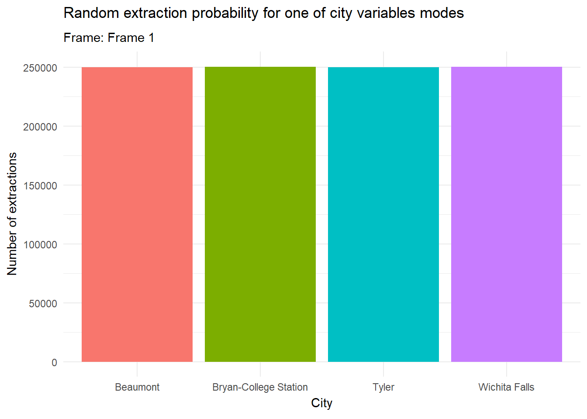
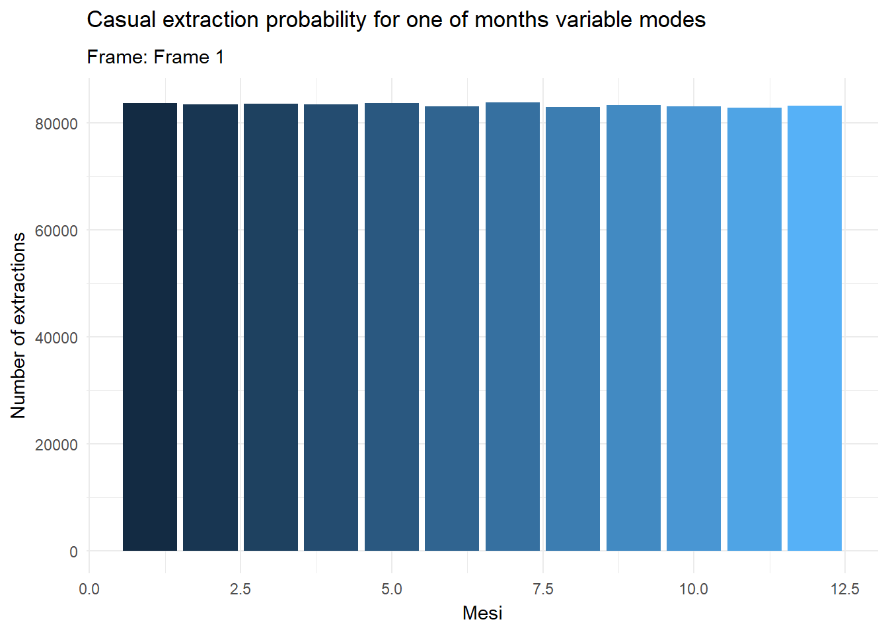
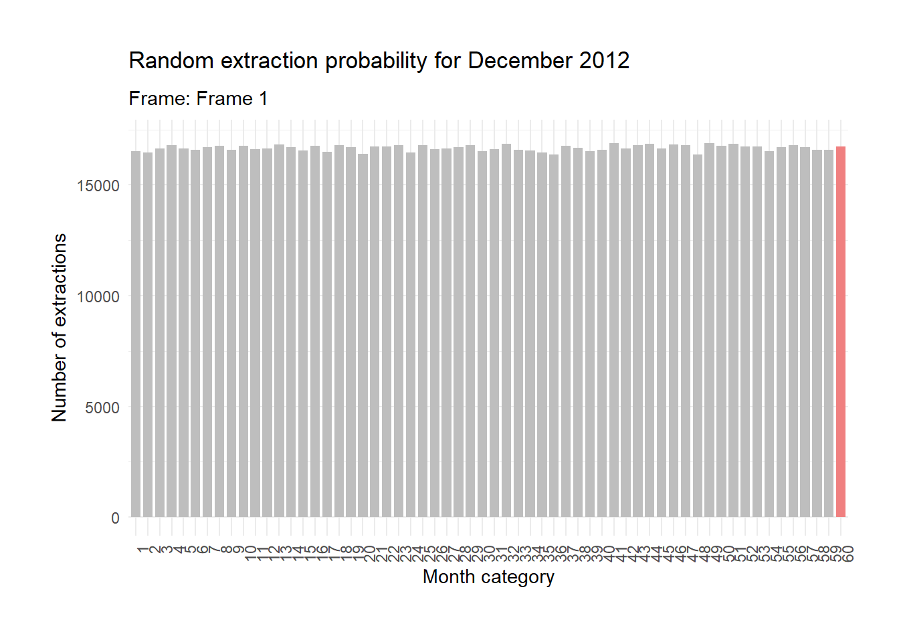

## Dataset variables types and pre-analysis.

First of all we will load our dataset from **"realestate_texas.csv"** and assign it to a dataframe.

```{r}
#Worksheet .CSV dataset import
realestate_stats= read.csv("realestate_texas.csv", sep=",")
```

To have an idea of samples and variables in our dataframe, we will print the dataset head() and have a variables and samples count.

```{r}
##Let's take a look at datasets' head to check on elements and variables.

head(realestate_stats)
```

```{r}
##Let's take a look at datasets' head to check on elements and variables.
dim(realestate_stats)
```

We will now identify all available variables in our dataframe and comment them briefly:

```{r}
#Dataset variables identification

str(realestate_stats)

```

The dataset attached to the Texas real estate market exploratory analysis project includes 8 statistical variables with 240 observations: These are:

-   City: **Nominal qualitative variable**. Useful for contextualizing the other variables due to the mutually exclusive nature of this type of variable, as well as necessary for calculating the mode for the n observations.

-   Year: **Continuous quantitative variable, in this case treated as an ordinal qualitative variable.** Particularly useful for comparing real estate market trends in the 4 cities considered, by constructing a graph that compares their respective time series with the available data.

-   Month: **Cyclic nominal qualitative variable, encoded numerically.** Monthly time series not only increase the resolution of the year-over-year comparison graph in the dataset but also allow us to identify specific annual seasonal cycles and understand trends in terms of monthly sales volumes, compared to the same periods in previous or subsequent years.

-   Sales: **Discrete quantitativa variable on a ratio scale** The number of sales made in the month taken under consideration. By building a time series with this data, we can identify annual trends and seasonal/monthly cycles over the years in the dataset. Additionally, we can highlight differences in the number of sales for the same periods of the year in different cities, along with total sales volumes, to determine where and when the most sales occur.

-   Total Sales Volume: **Continuous quantitative variable on a ratio scale**. The total sales volume can give us an insight into market behaviour and business performance, both on an annual and monthly scale, and by comparing it with other variables, such as the number of active listings, to hypothesize their influence on the total sales volume itself. Expressed in USD. 

-   Median Price: **Continuous quantitative variable on a ratio scale**. Long term changes in the median sales price may help identify trends in the real estate market of the city in question and make comparisons of price trends across the various cities in the dataset.

-   Listings: **Discrete quantitative variable.** The number of active listings for the month considered in the dataset, can be compared to the number of sales and volumes to identify any correlations between variables and the actual influence that the number of active real estate listings has on them.

-   Months per Inventory: Time required to clear the listings inventory, expressed in months. **Continuous quantitative variable on a ratio scale.** An excessive increase in the time required to clear inventory may indicate a saturated market or weak demand, while an overly short time may signal a drop in supply from property owners.

## Analysis of the variables main indices.

After identifying the nature of the variables in our dataset, we proceed to analyze the main statistical indices of each one. The logical approach applied is to break down the general problem ("the mass of data to be analyzed") into smaller problems that we can explore individually ("The information returned by processing each variable on its own").

#### city:

R does not have a built-in function for calculating the mode of a variable, so we decided to create our own custom function for this purpose:

```{r}
#R does not have a built-in function for calculating mode therefore we will develop one for this purpose

mode = function(x){
  u = unique(x)
  tab = tabulate(match(x, u))
  u[tab == max(tab)]
}
```

We will now use our custom written mode() function to calculate the mode of the "city" variable:

```{r}
city_mode = c(realestate_stats$city)
mode(city_mode)
```

The solution suggests that we may be dealing with a quadrimodal variable. To verify this we will call the table() function on the city variable and analyze the results:

```{r}
#Using the table function to verify whether variable is quadrimodal
table(realestate_stats$city)

```

The result is clear. **city is a quadrimodal variable, with the same number of observations for each city in the dataset.**

#### year:

With city revealing its quadrimodal nature, we can hypothesize that this is due to an equal observation period for each of the urban areas of interest. To confirm this, we will verify by finding the minimum and maximum values of "year" variable:

```{r}
#year variable min and max functions
min(realestate_stats$year)
max(realestate_stats$year)
```

We are dealing with 5 years of observations, which could be further divided into months. Otherwise, the 60 observations per city in the city variable would not be explained. The best approach is to build a frequency distribution to get a clear picture.

```{r}
#frequency distribution for "year" variable.
cytable = addmargins(table(realestate_stats$city, realestate_stats$year), 2)
print(cytable)
```

**We now have confirmation that, with 12 observations per year for each city, the dataset must be divided by month.** This leads us to the next variable.

#### month:

By calculating the range of the month variable, we can determine if all 12 months are present.

```{r}
#month variable range
range(realestate_stats$month)
```

and print the extended result for visual confirmation.

```{r}
#A final check for the presence of all 12 months in each year
#can be performed by taking the first 12 rows of the month variable from the dataset
print(realestate_stats$month[1:12])
```

Given the nature of this variable, it would not make sense to proceed with calculating other measures of central tendency, shape or variability for month. However, as a temporal variable, it will be very useful later on.

#### sales:

For the number of monthly sales in each city over the five year period, we can vary the resolution of our calculations at multiple levels.

First, let's **calculate the global measures of central tendency** for the entire sales variable, starting with the **min/max** values.

```{r}
#sales variable. min/max values calculation
minsales = min(realestate_stats$sales)
maxsales = max(realestate_stats$sales)
sprintf("sales variable minimum is: %i", minsales)
sprintf("sales variable maximum is: %i", maxsales)
```

Let's calculate the **median** for the total number of sales across all cities over the 5 years considered:

```{r}
#Let's calculate the median
mediansales = median(realestate_stats$sales)
sprintf("sales variable median is: %.2f", mediansales)
```

Let's also obtain the **mean** of the sales variable:

```{r}
#sales variable mean calculation
meansales = mean(realestate_stats$sales)
sprintf("The mean of the quantities sold across all cities and all the years considered is: %.2f", meansales)
```

Now that we have the minimum, maximum and mean, let's extract the **remaining quartiles** using the quantile() function as follows:

```{r}
#sales quartiles calculation
quantile_sales = quantile(realestate_stats$sales, probs= c(.25,.75))
print(quantile_sales)
```

#### Measures of variability for sales:

Let's start by calculating **range.**

```{r}
#calculating sales range:
varinterval = (maxsales-minsales)
sprintf("range for sales variable is: %i", varinterval)
```

Let's obtain the **interquartile range** using the dedicated function.

```{r}
#let's move on by calculating sales interquartile range:
intersales = IQR(realestate_stats$sales)
sprintf("sales variable interquartile range is: %i", intersales)
```

Let's obtain **the variance** of sales using the dedicated function.

```{r}
#sales variable variance calculation:
salesvar = var(realestate_stats$sales)
sprintf("Sales variable has a variance of: %.1f", salesvar)
```

Let's also obtain the **standard deviation** of the sales variable using the dedicated function.

```{r}
#Let's move on to calculate standard deviation by using the dedicated function:
stand_dev_sales = sd(realestate_stats$sales)
sprintf("Sales standard deviation is: %.3f", stand_dev_sales)
```

As there are no missing or negative values in the "sales" variable, we can also calculate the coefficient of variation; however, we need to create a specific function for this, as it is not included in the standard R package.

```{r}
#Let's write the coefficient of variation function.
coeff_var = function(x){
  return(sd(x)/mean(x)*100)
}
#Sales variable coefficient of variation calculation
salescv = coeff_var(realestate_stats$sales)
sprintf("sales variable coefficient of variation is: %.3f", salescv)
```

As this is not a qualitative variable, we will omit **the Gini's diversity index** pas it would not make sense to calculate it, let us move onto measures of shape.

#### Shape indices for sales:

The first shape index we want to calculate is **Fisher's skewness index**. For this first variable we will write the formulas by hand to demonstrate the process we used.

```{r}
#Let's proceed to calculate, for this first time, the skewness index by hand
salesn = length(realestate_stats$sales)
salesm3 = sum((realestate_stats$sales-meansales)^3)/salesn

asimmetry_sales_index = salesm3/stand_dev_sales^3
plot(density(realestate_stats$sales))
abline(v=meansales, col="red")
sprintf("sales skewness index is: %.3f", asimmetry_sales_index)
```

Let's now calculate **Kurtosis** by writing the appropriate formula.

```{r}
#Manual Kurtosis calculation
salesm4 = sum((realestate_stats$sales-meansales)^4)/salesn
kurtosis_sale_index = salesm4/stand_dev_sales^4 -3 
sprintf("Sales Kurtosis index is: %.3f", kurtosis_sale_index)
```

We note how Fisher's skewness index returns **a positive skewness**. The distribution therefore has a prevalence of low values/modes.

The kurtosis index also tells us the **distribution tends to be platykurtic**, meaning flattened compared to a normal distribution.

#### volume:

Volume variable, **measures of central tendency.**

```{r}
#Let's move to volume variable. Measures of central tendency.
minvolume = min(realestate_stats$volume)
maxvolume = max(realestate_stats$volume)
meanvolume = mean(realestate_stats$volume)
medianvolume = median(realestate_stats$volume)
quantile_volume = quantile(realestate_stats$volume, probs = c(.25, .75))
modevolume = mode(realestate_stats$volume)
sprintf("Volume variable has a min/max of: %.3f %.3f", minvolume, maxvolume)
sprintf("Volume variable mean is: %.3f", meanvolume)
sprintf("Volume variable meadian is: %.3f", medianvolume)
sprintf("Volume variable is trimodal: %.3f", modevolume)
print(quantile_volume)
```

Volume variable, **measures of dispersion.**

```{r}
#Volume measures of dispersion
volumevarinterval = (maxvolume-minvolume)
interquartile_volume = IQR(realestate_stats$volume)
volumevar = var(realestate_stats$volume)
volumesd = sd(realestate_stats$volume)
volume_coeff_var = coeff_var(realestate_stats$volume)
sprintf("Volume range is: %.3f", volumevarinterval)
sprintf("Volume interquartile range is: %.3f", interquartile_volume)
sprintf("Volume variance is: %.3f", volumevar)
sprintf("Volume standard deviation is: %.3f", volumesd)
sprintf("Volume coefficient of variation is: %.3f", volume_coeff_var)
```

Volume variable, **shape indices**

To speed up the calculation of shape indices from this point on I will use the skewness and kurtosis functions from the moments package.

```{r}
#volume, shape indices
library("moments")
asimmetry_volume_index = skewness(realestate_stats$volume)
kurtosis_volume_index = kurtosis(realestate_stats$volume)-3
plot(density(realestate_stats$volume))
abline(v=meanvolume, col="red")
sprintf("Volume skewness is: %.3f", asimmetry_volume_index)
sprintf("Volume kurtosis is: %.3f", kurtosis_volume_index)
```

Volume has **a positive skewness**, qso for this variable as well we observe predominantly low modes, with a kurtosis consistent with a **leptokurtic distribution**.

#### median_price:

median_price variable, **measures of central tendency.**

```{r}
#median_price, measures of central tendency
minmp = min(realestate_stats$median_price)
maxmp = max(realestate_stats$median_price)
meanmp = mean(realestate_stats$median_price)
medianmp = median(realestate_stats$median_price)
quantile_mp = quantile(realestate_stats$median_price, probs = c(.25, .75))
modemp = mode(realestate_stats$median_price)
sprintf("median_price variable has a min/max of: %i %i", minmp, maxmp)
sprintf("median_price variable mean is: %.3f", meanmp)
sprintf("median_price variable median is: %i", medianmp)
sprintf("median_price variable is unimodal: %i", modemp)
print(quantile_mp)
```

median_price, **measures of dispersion.**

```{r}
#median_price, mesures of dispersion.
mpvarinterval = (maxmp-minmp)
interquartile_mp = IQR(realestate_stats$median_price)
mpvar = var(realestate_stats$median_price)
mpsd = sd(realestate_stats$median_price)
mp_coeff_var = coeff_var(realestate_stats$median_price)
sprintf("median_price variable range is: %i", mpvarinterval)
sprintf("median_prince interquartile range: %i", interquartile_mp)
sprintf("mediane_prince variance is: %.3f", mpvar)
sprintf("median_prince standard deviation is: %.3f", mpsd)
sprintf("median_prince coefficient of variation is: %.3f", mp_coeff_var)

```

median_price, **shape indices**

To change how the charts look, and create something nicer, in this step I tried using R's ggplot2 package.

```{r}
#median_price, shape indices
library("ggplot2")
asimmetry_mp_index = skewness(realestate_stats$median_price)
kurtosis_mp_index = kurtosis(realestate_stats$median_price)-3

ggplot()+
  geom_density(aes(x=realestate_stats$median_price), col="black", fill="palegreen")+
  geom_vline(xintercept =meanmp, linewidth=1.5, color = "lightcoral")+
  labs(x="Median Price", y="Density")+
  geom_text(aes(x = meanmp + 20000, y = 1.8e-05, label = sprintf("Mean\n %.3f", meanmp)), inherit.aes = FALSE) +
  ylim(0, 2e-05)

sprintf("median_price skewness is: %.3f", asimmetry_mp_index)
sprintf("median_prince kurtosis is: %.3f", kurtosis_mp_index)
```

Median_prince variable has **a negative skewness** with a **platykurtic distribution**. The curve is flattened and most observed modes are high.

#### listings:

listings variable, **measures of central tendency.**

```{r}
#listings variable, measures of central tendency
minlist = min(realestate_stats$listings)
maxlist = max(realestate_stats$listings)
meanlist = mean(realestate_stats$listings)
medianlist = median(realestate_stats$listings)
quantile_list = quantile(realestate_stats$listings, probs = c(.25, .75))
modelist = mode(realestate_stats$listings)
sprintf("listings variable has a min/max of: %i %i", minlist, maxlist)
sprintf("listings variable mean is: %.3f", meanlist)
sprintf("listings variable median is: %.2f", medianlist)
sprintf("listings variable is unimodal: %i", modelist)
print(quantile_list)
```

listings variable, **measures of dispersion.**

```{r}
#listings variable, measures of dispersion
listvarinterval = (maxlist-minlist)
interquartile_list = IQR(realestate_stats$listings)
listvar = var(realestate_stats$listings)
listsd = sd(realestate_stats$listings)
list_coeff_var = coeff_var(realestate_stats$listings)
sprintf("listings variable range is: %i", listvarinterval)
sprintf("listings variable interquartile range is: %.2f", interquartile_list)
sprintf("listings variance is: %.3f", listvar)
sprintf("listings variable standard deviation is: %.3f", listsd)
sprintf("listings variable coefficient of variation is: %.3f", list_coeff_var)
```

listings, **shape indices.**

```{r}
#To determine the y-scale more precisely
#by which to place the label "mean", I used the density function
#applied to the listings variable. The max index of the listings density on y was used
#to correctly position the "mean" label in the plot
density_data = density(realestate_stats$listings)
max_listdensity = max(density_data$y)

#listings variable, shape indices
library("ggplot2")
asimmetry_lists_index = skewness(realestate_stats$listings)
kurtosis_lists_index = kurtosis(realestate_stats$listings)-3

ggplot()+
  geom_density(aes(x=realestate_stats$listings), col="black", fill="palegreen")+
  geom_vline(xintercept = meanlist, linewidth=1.5, color = "lightcoral")+
  labs(x="Active listings", y="Density")+
  geom_text(aes(x = meanlist+500, y = max_listdensity, label = sprintf("Mean\n %.3f", meanlist)), inherit.aes = FALSE) +
  xlim(0, 5000)

sprintf("listings variable skewness is: %.3f", asimmetry_lists_index)
sprintf("listings variable kurtosis is: %.3f", kurtosis_lists_index)
```

Fisher's skewness index on listings is positive. It's a **positive skewness** and most modes/values are low. The kurtosis is negative so we have a **platikurtic distribution.**

#### months inventory:

months inventory, **measures of central tendency.**

```{r}
#months_inventory variable, measures of central tendency
minmonths = min(realestate_stats$months_inventory)
maxmonths = max(realestate_stats$months_inventory)
meanmonths = mean(realestate_stats$months_inventory)
medianmonths = median(realestate_stats$months_inventory)
modemonths = mode(realestate_stats$months_inventory)
quantile_months = quantile(realestate_stats$months_inventory, probs = c(.25, .75))
modemonths = mode(realestate_stats$months_inventory)
sprintf("months_inventory variable has a min/max of: %.2f %.2f", minmonths, maxmonths)
sprintf("month_inventory mean is: %.3f", meanmonths)
sprintf("months_inventory median is: %.2f", medianmonths)
sprintf("months_inventory variable is unimodal: %.2f", modemonths)
print(quantile_months)
```

months inventory, **measures of dispersion.**

```{r}
#months_inventory variable, measures of dispersion
monthsvarinterval = (maxmonths-minmonths)
interquartile_months = IQR(realestate_stats$months_inventory)
monthsvar = var(realestate_stats$months_inventory)
monthssd = sd(realestate_stats$months_inventory)
months_coeff_var = coeff_var(realestate_stats$months_inventory)
sprintf("months_inventory variable range is: %.2f", monthsvarinterval)
sprintf("months_inventory variable interquartile range is: %.2f", interquartile_months)
sprintf("months_inventory variance is: %.3f", monthsvar)
sprintf("months_inventory variable standard deviation is: %.3f", monthssd)
sprintf("months_inventory variable coefficient of variance is: %.3f", months_coeff_var)
```

months_inventory, **shape indices.**

```{r}
#months_inventory variable, shape indices
library("ggplot2")
asimmetry_months_index = skewness(realestate_stats$months_inventory)
kurtosis_months_index = kurtosis(realestate_stats$months_inventory)-3

invendensity = density(realestate_stats$months_inventory)
invenmaxdensity = max(invendensity$y)

ggplot()+
  geom_density(aes(x=realestate_stats$months_inventory), col="black", fill="palegreen")+
  geom_vline(xintercept = meanmonths, linewidth=1.5, color = "lightcoral")+
  labs(x="Remaining time for\n active listings depletion", y="Density")+
  geom_text(aes(x = meanmonths+2, y = invenmaxdensity, label = sprintf("Mean\n %.3f", meanmonths)), inherit.aes = FALSE)+
  xlim(0,20)

sprintf("months_inventory skewness is: %.3f", asimmetry_months_index)
sprintf("months_inventory kurtosis is: %.3f", kurtosis_months_index)
```

months_inventory has **a positive skewness**. Low modes are therefore more frequent. The kurtosis is negative, so we have a **platykurtic distribution**.

## Preliminary considerations on coefficient of variation and skewness.

#### Let's compare the coefficient of variation.

I will use a lollipop chart in ggplot2 to compare the coefficients of variation of the variables for which it was calculated.

```{r}
#Let's make the initial comparisons on variance and skewness for the available data
#we use ggplot2 and a lollipop chart to highlight the differences

#Comparison of variability

library("ggplot2")

cvarcomparison = data.frame(
  x = c(salescv, volume_coeff_var, mp_coeff_var, list_coeff_var, months_coeff_var),
  y = factor(c("Sales,", "Total Sales Volume", "Median Price", "Listings", "Months per Inventory"),
             levels = c("Sales,", "Total Sales Volume", "Median Price", "Listings", "Months per Inventory"))
)

# plotting a lollipop chart with ggplot2
ggplot(cvarcomparison, aes(x = x, y = y)) +
  geom_segment(aes(x = 0, xend = x, y = y, yend = y), color = "grey") +
  geom_point(aes(x = x), color = "red", fill=alpha("lightcoral", 0.3), alpha=0.7, shape=21, stroke=1.5, size = 5) +
  geom_text(aes(label=round(x, 3)), hjust = -0.3, color= "black")+
  theme_light() +
  theme(
    panel.grid.major.x = element_blank(),
    panel.border = element_blank(),
    axis.ticks.x = element_blank(),
    plot.title.position = "plot"
    ) +
  xlab("Coefficients of variation") +
  ylab("")+
  labs(title = "Coefficients of variation comparison",
       subtitle = "Using the realestate_texas.csv dataset tuned accordingly")+
  coord_flip()
```

The plot clearly shows that the variable **volume ("Sales Volume")** has the highest coefficient of variation. Let's proceed to evaluate its skewness using Fisher's skewness index.

#### Let's compare the Fisher skewness indices of the variables.

```{r}
#Skewness comparison

asimmetrycomparison = data.frame(
  x = c(asimmetry_sales_index, asimmetry_volume_index, asimmetry_mp_index, asimmetry_lists_index, asimmetry_months_index),
  y = factor(c("Sales", "Total Sales Volume", "Median Price", "Listings", "Months per inventory"),
             levels = c("Sales", "Total Sales Volume", "Median Price", "Listings", "Months per inventory"))
)

# lollipop chart plotting through ggplot2
ggplot(asimmetrycomparison, aes(x = x, y = y)) +
  geom_segment(aes(x = 0, xend = x, y = y, yend = y), color = "grey") +
  geom_point(aes(x = x), color = "blue", fill=alpha("lightblue", 0.3), alpha=0.7, shape=21, stroke=1.5, size = 5) +
  geom_text(aes(label=round(x, 3)), hjust = -0.3, color= "black")+
  theme_light() +
  theme(
    panel.grid.major.x = element_blank(),
    panel.border = element_blank(),
    axis.ticks.x = element_blank(),
    plot.title.position = "plot"
  ) +
  xlab("Fisher's Skewness") +
  ylab("")+
  labs(title = "Fisher Skewness comparison",
       subtitle = "Using the realestate_texas.csv dataset tuned accordingly")+
  coord_flip()
```

As shown in the chart, only one of the variables has a negative skewness index, while **Total sales volume** (volume) again proves to be the variable with the highest skewness index.

## Frequency distribution and further evaluations on sales variable.

I choose the sales variable to perform a class-based grouping of the values, build the frequency distribution, then display it graphically and calculate the Gini Index.

**Class division and frequency distribution.**

```{r}
#We select the sales variable to perform a class division
#We develop its frequency distribution and display it in a bar chart
#We will then proceed to calculate the Gini index of the chosen variable

#sales, class division
salesclass = cut(realestate_stats$sales, breaks = seq(50,450, by=50), right = FALSE)

#calculating frequencies and organizing the distribution

sales_ndistribution = table(salesclass)
sales_frtable = sales_ndistribution/sum(sales_ndistribution)
sales_cumsum = cumsum(sales_ndistribution)
sales_cumrel = sales_cumsum/sum(sales_ndistribution)

finaltable = cbind(ni=sales_ndistribution, fi=sales_frtable, Ni=sales_cumsum, Fi=sales_cumrel)
colnames(finaltable) = c("Abs. Frequencies", "Rel. Frequencies", "Cumulated abs. frequenceis", "Cumulated rel. frequencies")
print(finaltable)

```

Let's Insert the frequency distribution into a plot created with ggplot2 that accounts for the n observations and the classes of the variable.

```{r}
#Using the distribution with a ggplot2 chart.

#dataframe to use with the chart
saled_distribution_data = data.frame(
  salesclass = as.factor(names(sales_ndistribution)),
  n = as.vector(sales_ndistribution)
)

ggplot(saled_distribution_data, aes(x=salesclass, y = n, fill = salesclass))+
  geom_bar(stat = "identity", fill="grey")+
  scale_x_discrete(limits = levels(salesclass))+
  labs(x = "variable classes", y = "n observations")+
  theme(legend.position = "none",
        plot.title.position = "plot")+
  labs(title = "Sales variable frequency distributions",
        subtitle = "n observations separated into classes")

```

Now let's calculate the Gini heterogeneity index of the frequency distribution for sales we just constructed.

```{r}
#Sales Gini heterogeneity index calculation
#let's build the function accordingly
gini.index = function(x){
  ni=table(x)
  fi=ni/length(x)
  fi2=fi^2
  J=length(table(x))
  
  gini= 1-sum(fi2)
  gini.normalizzato = gini/((J-1)/J)
  
  return (gini.normalizzato)
}

#proceeding to calculation
salesgini = gini.index(salesclass)
sprintf("sales variable frequency distribution has a Gini geterogeneity index of: %.3f", salesgini)
```

**We compute the Gini heterogeneity index on the class distribution of the sales variable.** The result is 0.923, so we note we are close to a condition of maximum heterogeneity (Gini = 1)

## Examples of probability calculations on the variables.

#### What is the probability of randomly drawing "Beaumont" among the cities in the city variable?

```{r, warning=FALSE, message=FALSE}
#Probability calculations

#We consider the probability that, with a sufficient number of trials, the city of Beaumont will be drawn from the dataset.
#Building the related chart.

library("ggplot2")
library("gganimate")
library("dplyr")
library("gifski")
library("knitr")

frames = lapply(1:10, function(i){
  data.frame(city = sample(realestate_stats$city, 1000000, replace = TRUE),
             frame = paste("Frame", i))
})

framedata = do.call(rbind, frames)

framedata_summary = framedata %>%
  group_by(city, frame) %>%
  summarise(count = n(), .groups = "drop")

animated_plot = ggplot(framedata_summary, aes(x = city, y = count, fill = city)) +
  geom_bar(stat = 'identity') +
  theme_minimal() +
  labs(x = "City", y = "Number of extractions") +
  transition_states(
    frame,
    transition_length = 2,
    state_length = 1
  ) +
  ease_aes('linear')+
  labs(title = "Random extraction probability for one of city variables modes",
       subtitle = "Frame: {closest_state}")+
  theme(legend.position = "none")

cityanimation = animate(animated_plot, fps = 15, duration = 5, nframes = 30, renderer = gifski_renderer())
anim_save("city_probability_animation.gif", animation = cityanimation)


#Classic probability for city variable.

city_classic_prob = (60/240)
city_relative_prob = (city_classic_prob*100)
sprintf("The plot visually represents what the classical probability calculation tells us about the city variable. With a sufficient number of extraction attempts, the city variable will yield a probability of %.1f%% obtaining the city of Beaumont", city_relative_prob)
```

We demonstrate, through classical probability and a chart, that the random drawing of the city Beaumont from the rows of the city variable has a 25% chance of being drawn with a sufficient number of trials.

#### What is the probability of randomly drawing the month of July from the rows of the month variable?

```{r}
#Let's consider the month variable for July
#We also build the related chart

library("ggplot2")
library("gganimate")
library("dplyr")
library("gifski")
library("knitr")

frames_month = lapply(1:10, function(i){
  data.frame(months = sample(realestate_stats$month, 1000000, replace = TRUE),
             frame = paste("Frame", i))
})

frame_month_data = do.call(rbind, frames_month)

framedatamonth_summary = frame_month_data %>%
  group_by(months, frame) %>%
  summarise(count = n(), .groups = "drop")

animated_plot_months = ggplot(framedatamonth_summary, aes(x = months, y = count, fill = months)) +
  geom_bar(stat = 'identity') +
  theme_minimal() +
  labs(x = "Mesi", y = "Number of extractions") +
  transition_states(
    frame,
    transition_length = 2,
    state_length = 1
  ) +
  ease_aes('linear')+
  labs(title = "Casual extraction probability for one of months variable modes",
       subtitle = "Frame: {closest_state}")+
  theme(legend.position = "none")

monthsanimation = animate(animated_plot_months, fps = 15, duration = 5, nframes = 30, renderer = gifski_renderer())
anim_save("months_probability_animation.gif", animation = monthsanimation)


#Classic probability for months variable

month_classic_prob = (20/240)
month_relative_prob = (month_classic_prob*100)
sprintf("The plot visually represents what the classical probability calculation tells us about the month variable. With a sufficient number of extraction attempts, the month variable will yield a probability of %.1f%% obtaining the month of July", month_relative_prob)
```

We demonstrate, through the chart and using classical probability, that the random drawing of the month of July from the rows of the month variable has an 8.3% chance of being drawn with a sufficient numbero of trials.

#### What is the probability of randomly drawing December 2012 from the rows of the dataset?

```{r}
#We evaluate the probability that December 2012 is drawn from the dataset

#plotting the chart
library("ggplot2")
library("gganimate")
library("dplyr")
library("gifski")
library("knitr")


#probability calculation
twentyt_classic_prob = (4/240)
twentyt_relative_prob = (twentyt_classic_prob*100)

sprintf("The plot visually represents what the classical probability calculation tells us. With a sufficient number of extraction attempts, the December 2012 category will yield a probability of %.1f%% of being drawn.", twentyt_relative_prob)

set.seed(42) 
months_full_dataset = c(rep(1:59, each = 4), rep(60, times = 4))

frames_twentyt = lapply(1:10, function(i) {
  data.frame(
    month_category = sample(months_full_dataset, 1000000, replace = TRUE),
    frame = paste("Frame", i)
  )
})

frame_twentyt_data = do.call(rbind, frames_twentyt)

framedatatwentyt_summary = frame_twentyt_data %>%
  group_by(month_category, frame) %>%
  summarise(count = n(), .groups = "drop") %>%
  mutate(color_group = ifelse(month_category == 60, "December", "Other months"))

animated_plot_twentyt = ggplot(framedatatwentyt_summary, aes(x = as.factor(month_category), y = count, fill = color_group)) +
  geom_bar(stat = 'identity', position = "dodge", width = 0.8) +
  theme_minimal() +
  labs(x = "Month category", y = "Number of extractions") +
  transition_states(
    frame,
    transition_length = 2,
    state_length = 1
  ) +
  ease_aes('linear')+
  labs(title = "Random extraction probability for December 2012",
       subtitle = "Frame: {closest_state}")+
  scale_fill_manual(values = c("December" = "lightcoral", "Other months" = "grey"))+
  theme(legend.position = "none",
        axis.text.x = element_text(angle = 90, hjust = 1),
        plot.margin = margin(1, 1, 1, 1, "cm"))

twentytanimation = animate(animated_plot_twentyt, 
                           fps = 15, 
                           duration = 5, 
                           nframes = 30, 
                           renderer = gifski_renderer()
                           )
anim_save("twentyt_probability_animation.gif", animation = twentytanimation)

```

As we note from the probability calculation and the chart, we obtain **an equal probability of 1.7%** of drawing December 2012 from the dataset with a sufficient number of draws.

## Adding the average price to the dataset.

We take advantage of the available data to add the column of the monthly average price for each row of the dataset, since currently only the median price is present.

```{r}
#Let's add a column to the dataset with the average property price

realestate_stats$mean_price = (realestate_stats$volume/realestate_stats$sales)*1000000
```

## Assessing the listings effectiveness

We now relate the number of sales to active listings to verify the conversion effectiveness of listings into sales, representing everything into a lollipop chart.

```{r, warning=FALSE, message=FALSE}
#To evaluate listings effectiveness, we relate monthly sales to active listings of the same month

realestate_stats$listings_efficiency = realestate_stats$sales/realestate_stats$listings

#before plotting, we need the means of the listings_efficiency variable to better represent effectiveness by city.

realestate_listingse_summary = realestate_stats %>%
  group_by(city) %>%
  summarise(listings_efficiency = mean(listings_efficiency))

#Let's build the chart now

ggplot(realestate_listingse_summary, aes(x=listings_efficiency, y=city)) +
  geom_segment(aes(x=0, xend=listings_efficiency, y=city, yend=city), color="grey", size = 1) +
  geom_point(aes(x= listings_efficiency, y = city), color="lightcoral", size=5) +
  theme_light() +
  theme(
    panel.grid.major.x = element_blank(),
    panel.border = element_blank(),
    axis.ticks.x = element_blank(),
    plot.title.position = "plot"
  ) +
  labs(x="Listings effectiveness", y="City", 
       title = "Grafico di efficacia delle inserzioni",
       subtitle = "Representation of the mean ratio of completed sales to total listings for each month")
```

As shown in the chart, Bryan-College Station has the highest efficiency in converting active listings into sales for each month.

Below we also show a printout of the data used.

```{r}
print(realestate_listingse_summary)
```

By converting the ratio into a percentage, we realize that:

```{r}
realestate_listingse_summary$percent = realestate_listingse_summary$listings_efficiency*100
print(realestate_listingse_summary)
```

**Bryan-College Station on average converts 14.7% of active listings on a monthly basis.**

## Further considerations on data.

#### Construction of a time series with monthly sales data.

```{r, warning=FALSE, message=FALSE}
#Further dataset considerations

#We create a time series of sales for the four cities in the dataset, comparing them in a single plot

#First, we create a group with the dataset's cities

sales_group_data = realestate_stats %>%
  group_by(city, year, month) %>%
  summarise(total_sales = sum(sales, na.rm = TRUE)) %>%
  ungroup() %>%
  mutate(date = as.Date(paste(year, month, "01", sep = "-")))

#Plotting chart

ggplot(sales_group_data, aes(x = date, y = total_sales, group = city, color = city))+
  geom_line(size = 1.2)+
  theme_minimal()+
  labs(title = "Comparative sales time series for the dataset's cities",
       x = "Year",
       y = "Number of Sales",
       color = "City")+
  theme(
    legend.position = "bottom",
    plot.title = element_text(hjust = 0.5))+
  facet_wrap(~ city, scales="free_y")
```

The initial observations from the chart show **a certain seasonality in the number of sales**, which tend to drop considerably during the winter period in all cities and then rise in the middle months with a "wave"-like pattern..

We also note that sales appear to be trrending upward in all cities except Wichita Falls, where no significant upward trend is observed over the 5 years.

#### Use of boxplots to compare the distribution of median price across cities.
```{r}
#We compare the distribution of median house prices across the cities
#using 4 separate boxplots

#plotting chart
ggplot(realestate_stats, aes(x = city, y = median_price))+
  geom_boxplot(
    color = "indianred4",
    fill = "indianred3",
    alpha = 0.2,
    outlier.colour = "mediumvioletred",
    outlier.fill = "mediumvioletred",
    outlier.size = 3,
  )+
  theme_minimal()+
  labs(title = "Median price distribution for all four cities",
       x = "City",
       y = "Median Price")+
  theme(plot.title = element_text(hjust = 0.5))
```

As visible from the boxplot comparison, Bryan-College Station shows the median price distribution with higher values than all other cities, while Whichita Falls has the lowest values. Tyler is the only city without outliers in the distribution.

#### Using a bar chart to represent the total sales volume categorized by city and split by year.

```{r message=FALSE, warning=FALSE}
#We now consider the total sales value broken down by city and year

#We use the hrbhthemes library and then aggregate the data.
library("hrbrthemes")

volume_group = realestate_stats %>%
  group_by(year, city) %>%
  summarise(total_volume_data = sum(volume, na.rm = TRUE)) %>%
  ungroup()

#Plotting chart

ggplot(volume_group, aes(x = city, y = total_volume_data, fill = factor(year)))+
  geom_bar(stat="Identity", color="#e9ecef", position=position_dodge(), alpha=0.6)+
  scale_fill_manual(values = c("#69b3a2", "#404080", "#FF6347", "#4682B4", "#FFA500"))+
  theme_ipsum()+
  labs(fill = "Years", title = "Total volume of sales distribution",
       subtitle = "Data broken down by year and city",
       x= "City", y ="Total sales volume in mil$")+
  theme(axis.text.x = element_text(angle=45, hjust=1),
        plot.title.position = "plot")
```

The chart clearly shows that Bryan-College Station and Tyler increased sales volumes in 2013 and 2014, an effect also seen moderately in Beaumont. Wichita Falls, however, has lower sales volumes (in mil$) compared with all other cities in the dataset.

#### Monthly total sales plot by city.

```{r warning=FALSE, message=FALSE}
#stacked bar chart with total sales by city (monthly)

sales_grouping = realestate_stats %>%
  group_by(city, month) %>%
  summarise(total_sales = sum(sales, na.rm = TRUE)) %>%
  ungroup()

ggplot(sales_grouping, aes(x = as.factor(month), y = total_sales, fill = city)) +
  geom_bar(stat = "identity", position = "Stack") +
  scale_fill_hue(c = 40)+
  theme_minimal()+
  labs(title = "Total monthly sales by city",
       x = "Month",
       y = "Total sales",
       fill = "City")+
  theme(
    legend.position = "bottom",
    plot.title = element_text(hjust = 0.5)
  )
```

Let's also consider the normalized version for this chart.

```{r}
ggplot(sales_grouping, aes(x = as.factor(month), y = total_sales, fill = city)) +
  geom_bar(stat = "identity", position = "fill") +
  scale_fill_hue(c = 40)+
  theme_minimal()+
  labs(title = "Normalized distribution of monthly sales",
       x = "Month",
       y = "Total sales",
       fill = "City")+
  theme(
    legend.position = "bottom",
    plot.title = element_text(hjust = 0.5)
  )+
  scale_y_continuous(labels = scales::percent)
```

As hypotesized from previous observations on the time series and sales volume distribution, we confirm that Tyler and Bryan-College Station are the **cities showing the highest number of sales**, with Wichita presenting marginal data compared to the other four. Tyler and Bryan-College data appear to occupy the largest share of the distribution percentage.

We proceed to split non-normalized plot by year, thus including a breakdown by month, year and city.

```{r warning=FALSE, message=FALSE}
#Let's try to also include the year breakdown by creating separate stacked bar charts.

sales_grouping = realestate_stats %>%
  group_by(city, year, month) %>%
  summarise(total_sales = sum(sales, na.rm = TRUE)) %>%
  ungroup()

ggplot(sales_grouping, aes(x = as.factor(month), y = total_sales, fill = city)) +
  geom_bar(stat = "identity", position = "stack") +
  scale_fill_hue(c = 40) +
  theme_minimal() +
  labs(title = "Total monthly sales for each city",
       x = "Month",
       y = "Total Sales",
       fill = "City") +
  theme(
    legend.position = "bottom",
    plot.title = element_text(hjust = 0.5)
  ) +
  facet_wrap(~ year, ncol = 1)
```

As a plotting excercise, we can **represent the same situation with a heatmap.**

```{r warning=FALSE, message=FALSE}
#We use the same data for a heatmap.

library(ggplot2)
library(dplyr)

monthly_sales_grouping = realestate_stats %>%
  group_by(city, year, month) %>%
  summarise(total_sales = sum(sales, na.rm = TRUE)) %>%
  ungroup()

heatmap_plot = ggplot(monthly_sales_grouping, aes(x = factor(month, levels = 1:12), y = city, fill = total_sales)) +
  geom_tile(color = "white") +
  facet_wrap(~ year, ncol = 1) +
  scale_fill_gradient(low = "white", high = "lightcoral") +
  labs(title = "Monthly sales by city and year heatmap",
       x = "Month",
       y = "City",
       fill = "Total Sales") +
  theme_minimal() +
  theme(axis.text.x = element_text(angle = 0, hjust = 1))

print(heatmap_plot)
```

Having added the variable to the dataset, it is also worth exploring the **evolution of the average price in a time series** split by city, using a stacked area chart.

```{r warning=FALSE, message=FALSE}
#Let's build a time series of the average price
mean_group_data = realestate_stats %>%
  group_by(city, year, month) %>%
  summarise(total_mean_price = sum(mean_price, na.rm = TRUE)) %>%
  ungroup() %>%
  mutate(date = as.Date(paste(year, month, "01", sep = "-")))

#Plotting the chart

ggplot(mean_group_data, aes(x = date, y = total_mean_price, group = city, fill = city))+
  geom_area(alpha = 0.6, color = "black", size = 0.5)+
  theme_minimal()+
  labs(title = "Mean price by city time series",
       x = "Year",
       y = "Mean Price",
       fill = "City")+
  theme(
    legend.position = "bottom",
    plot.title = element_text(hjust = 0.5))+
  facet_wrap(~ city, scales = "free_y")+
  scale_y_continuous(labels = scales::comma)
```

## Further considerations

Analyzing the results from the processed data in this dataset, we can start from the listings effectiveness chart to note how **Wichita Falls**, second in the mean ratio of completed sales to total listings, is actually also the one showing a flatter sales trend in absolute values (in mil$) and in absolute number of sales over the considered years. These data and the distribution of Wichita Falls' median price shown in the boxplot lead us to hypothesize a period of crisis in Texas area's housing market, with generally low demand.

Also the **average property price** in Wichita Falls does not show significant trends or changes over the five years considered. In contrast, Bryan-College Station experiences a clear upward trend in average price in the datasets' last two years, partly visible in Tyler as well.

Regarding the city of **Tyler**, we observe that the volume and number of sales data, compared with the relatively lower listings conversion effectiveness, suggest that improving the conversion efficiency could potentially raise that area's market performance.
